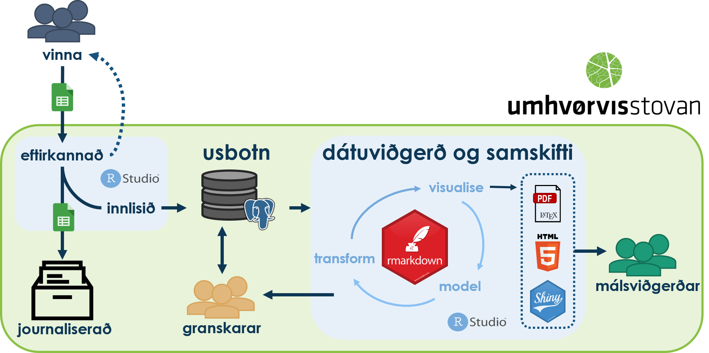

\newpage


```{r setup, include=FALSE}
knitr::opts_chunk$set(echo = TRUE,
                      fig.align = "center",
                      connection = "con_demo")

library(tidyverse)
library(DBI)
library(shiny)
```

```{r usbotn, include=FALSE, eval=TRUE}
conbotn <- dbConnect(odbc::odbc(),
                 Driver = "PostgreSQL Unicode(x64)", 
                 Server = params$server,
                 Database = params$database,
                 UID = params$username,
                 PWD = params$password,
                 Port = 5432,
                 encoding = "windows-1252")

```


# Botnkanningar á føroysku firðunum

Botnkanningar (sedimentkanningar) á føroysku firðunum eru gjørdar seinastu uml. 30. árini, hesar kanningar eru serliga framdar í samband við umhvørviseftirlit við alivirksemi á sjónum. Avvarandi umhvørvismyndugleikin (Heilsufrøðiliga starvsstovan og síðani Umhvørvisstovan) hevur fingið frágreiðingarnar av hesum botnkanningunum inn analogt (papír), talgilt (pdf) og í ein yvirgang eru úrslitini eisini komin inn sum XML ella excel. Men ongantíð eru hesar dátur blivnar skipaðar í ein dátugrunn. Málsviðgerðar hava skipa dáturnar eftir besta førimuni og eftir teirra tørvi á ymiskan hátt, hetta er tó aldri blivi samskipað til eitt nýtiligt og atkomuligt amboð.

Hesar dátur skulu so nú skipast í ein dátugrunn, hesin dátugrunnur hevur fingið navnið **usbotn** (**U**mhvørvis**S**tovan - **botn**kanningar). Hesar dátur eru at finna í uml. 500 frágreiðingum, har tær flestu bert eru tøkar sum pdf.

# Endamálið við usbotn dátugrunninum

Endamálið er at fáa allar tær botnkanningarnar, ið eru gjørdar í Føroyum (og sum Umhvørvisstovan hevur atgongd til) skipaðar í ein samtalvudátugrunn (relational database) so at dáturnar eru læt atkomiligar og framtíðartryggjaðar. Týdningarmesta nyttan av at fáa hesar dátur skipaðar er ein effektivari umhvørvisfyrisiting. Soleiðis at usbotn dátugrunnurin verður ein nátúrligur partur af málsviðgerðini.

# Nýtsla

Til dátugrunnin eru tvinni sløg av brúkarum at hava í huga hjá Umhvørvisstovuni, málsviðgerðar og granskarar. Hesir brúkarabólkar seta ymisk krøv til bæði dátugóðsku og nýtslu.

Dátugóðskan, skal verða so høg sum til ber fyri betri at kunna sikkra ein framtíðartørv.

Stórsti munurin millum eitt komandi nýtslumynstur hjá granskarum og málsviðgerðum er: málsviðgerðar hava tørv á einum afturvendandi dynamiskum, automatiskum úttrekki frá dátugrunninum, ið inniheldur allar tær dátur (longu viðgjørdar), ið tørvur er á til tí serstøku málsviðgerðina, í meðan ein granskari oftari hevur brúk fyri ser úttrekkum, sum ikki ofta eru afturvendandi.

Ætlaða nýtslu mynstri er, at Umhvørvisstovan fær frágreiðing saman við rádátum inn til viðgerar, rádáturnar verða eftirkanaðar (sendar aftur til avsendaran um feilir eru í) og síðani innlisnar í usbotn og original fílurin verður journaliseraður. Tá málsviðgerðin skal í gongd ger málviðgerðin eitt úttrekk úr usbotn við øllum teimum viðkomandi og viðgjørdu dátunum, sí Figur \@ref(fig:users).

```{r users, fig.cap="Nýtslumynstur av usbotn", echo=FALSE, out.width='100%'}


```

# Usbotn uppbygnaður

Til júst henda dátugrunnin er støðan eitt sindur serlig, av tí at hetta eru gomul data, sum skulu skipast í ein dátugrunn. So hetta krevur eitt sindur av "reverse engineering" av tøku frágreiðingunum, soleiðis dátugrunnurin fer at rúma øllum teimum gomlu, nýggju, og framtíðar dátunum.

## Sjálvar botnkanningarnar
Botnkanningarnar eru framdar eftir tí til tað tíð galdandi kanningarvegleiðing ella kanningarstandardi, sum var ásettur av umhvørvismynugleikanum. tey seinastu 30 árini eur broytingar framdar frá bæði mynduleikasíðuni og kanningarfeløgunum. Frágreiðingarnar eru av hesi orsøk ikki eins yvir tíð ei heldur tvørtur um kanningarfeløg. Tí er tíðandi at usbotn kann innihalda øll úrslit frá gomlu frágreiðingunum á ein hátt so at tað lætt ber til at dátuviðgera hesi úrslit saman við nýggjari úrslitum, sjálvt um ymiskir standardir eru nýttir. Hetta fer eisini at gera tað smidligari at tillaga usbotn eftir framtíðar broytingum í kanningarvegleiðingunum.

Hvør frágreiðing fevnur um eitt aliøki, og inniheldur eitt ávíst tal av botnsýnum (eitt sýni = ein grabbi). Ymiskar kanningar verða síðani framdar av sýnum, kanningarnar fyrlgja galdandi vegleiðing (sí http://us.fo/Admin/Public/DWSDownload.aspx?File=%2fFiles%2fFiler%2fUS%2fdalking_og_vernd%2fvegleidingar%2f2019-18_Umhvorviseftiransing_Aling_120318.pdf).

Í stórum trekkum eru trý sløg av kanningum:

- Einføld kanning
    - einføld djóralívskanning
    - pH og redox kanningar
    - sensoriskar kanningar
    - myndir
- Evnafrøðiligar kanningar
- Djóralívskanningar

Eitt dømi um hvussu kanningarvegleiðingin er broytt yvir tíð, er hvussu litur av botnsýninum er blivin ásettur. Í gomlu kanningarvegleiðingini kundi liturin metast at verða, ljósur, hálvmyrkur ella myrkur sum fekk stigatalið ávikavist 0, 1, og 3. Meðan eftir tí nýggju kanningarvegleiðingini so er ásett at litur antin er ljósur/gráur ella brúnur/svartur, sum hevur stigatalið ávikavist 0 ella 2. Hetta merkir at tað ber ikki til at hava sjálvt stigatali (numeric) sum úrslit fyri lit, tí hetta kann broytast. Tí var avgerð tikin um nýta "ID codes" fyri litin, so at broytingar í stigatali kunnu tollererast framyvir, kolonnan *litur_stig_original* hevur stigatalið ið litur fekk frá byrjan, meðan kolonnan *litur_stig_adjusted* hevur stigatalið ið er galdandi til dags dato, sí Table \@ref(tab:litur).


```{r litur, echo=FALSE, eval=TRUE, fig.cap="litur talvan, vísur litur_stig_original og litur_stig_adjusted"}
litur <- tbl(conbotn, "litur") %>% 
  collect()
knitr::kable(litur, caption = "Talvan litur úr usbotn", booktabs = T) %>% 
  kableExtra::kable_styling(latex_options = c("scale_down", " hold_position"))
```


## Relational Model

Av tí at dáturnar longu eru kendar helt eg tað verða lættari at gera eitt *Relational Model* frá byrjan í staðin fyri eitt Entity Relation Diagram (ERD), sí Figure  \@ref(fig:ERD).

```{r ERD, fig.cap="usbotn talvu relatións diagram", echo=FALSE}
knitr::include_graphics("images/usbotn - ERD.pdf")

```


## ODBC connection

usbotn dátugrunnurin liggur í einum postgreSQL ver. 11.0 databasuskipan á einum servara handan ein firewall. Tí verður eitt líknandi "spæli" servara setup nýtt til demo av dátugrunninum til hesa uppgávuna.

R code chunk fyri eina odbc connection til dátugrunnin:

```{r connection, eval=FALSE, fig.cap="odbc connection"}
con_demo <- dbConnect(odbc::odbc(),
                 Driver = "PostgreSQL Unicode(x64)", 
                 Server = "hostname or ip address",
                 Database = "database name",
                 UID = rstudioapi::showPrompt("Database Username", "Username"),
                 PWD = rstudioapi::askForPassword("Database password"),
                 Port = 5432)

```

## DDL
Data definition language (DDL) til usbotn er viðheft í Appendix A. Usbotn er uppbygdur av:
 
- 38 tables
- 4 views
- 1 function
- 1 procedure
- 2 trigger functions
- 1 sequence


### Evnafrøðiligar kanningar
Evnafrøðiligu kanningar úrslitini ligga í talvuni *urslitkemi* (sí Appendix A) sum hevur:

- kemi_id serial primary key, *hvørt úrslit hevur sítt egna id, hetta fyri at loyva replikat mátingum*
- botn_id
- evni
- virdi
- eind
- urslitkemi_vidmerking
- virdi_conv *hesi verða fylt út automatiskt via ein trigger*
- eind_conv *hesi verða fylt út automatiskt via ein trigger*
- basis
- qflag
- lod
- loq
- matiovissa
- met_matiovissa
- starvsstova

virdi_conv og eind_conv verða útfylt automatiskt á dátugrunninum við einum trigger (insert og update) sum er lagdur á *urslitkemi* og *eind* talvurnar og útloysir eina funktión til converterings útrokningina. 

```{sql eval=FALSE}

--funktión sum umroknar virdi til virdi_conv og setur nýggju eindina inn 
create or replace function kemi_conv()
  returns trigger
  language plpgsql
as $$

declare
  virdi_conv numeric(20,8);
  eind_conv varchar(5);
  convertfactor numeric(8,3);

begin
  --finn converterings factorin fyri innsettu eindina
  select eind_convertfactor
  from eind
  where eind_id like NEW.eind
  into convertfactor;
  
  --finn converterings eindina (convert to) fyri innsettu eindina
  select eind_convertto
  from eind
  where eind_id like NEW.eind
  into eind_conv;
  
  select eind_conv
  into NEW.eind_conv;
  
  virdi_conv := NEW.virdi * convertfactor;
  select virdi_conv
  into NEW.virdi_conv;
  
  return NEW;
  
end;
$$;

--before insert and on update trigger on urslitkemi that uses function kemi_conv()
drop trigger if exists urslitkemi_ins
  on urslitkemi;
create trigger urslitkemi_ins
  before insert or update
  on urslitkemi
  for each row execute procedure kemi_conv();

```

Hesin procedure skal eisini leggjast á *eind* talvuna, so at eitt insert ella update á hesa talvuna, útloysir umrokning av virdi_conv og inseting av eind_conv á *urslitkemi* talvuni. Hetta so at virdi_conv altíð eru tey røttu!!

```{sql eval=FALSE}
--funktíon til at "falskt uppdatera" urslitkemi talvuna
create or replace function eind_update()
  returns trigger
  language plpgsql
as $$
begin
  update urslitkemi
  set virdi = virdi;
  return NEW;
end;
$$;

--after insert or update on ein falskt updatera urslitkemi talvuna
--so at kemi_conv() fer í gongd.
drop trigger if exists eind_ins
  on eind;
create trigger eind_ins
  after insert or update
  on eind
  for each row execute procedure eind_update();

```

### Miðalstøður 

#### Evnafrøðiligu miðalstøðurnar (view)
Ein miðal verður roknaður av **trimum** teimum hægstu evnafrøðiligu úrslitunum pr. fráreiðing pr. støðslag pr. alieind og pr. evni. Síðani verður støðan (út frá galdandi vegleiðing) ásett pr. evni og síðan verður hægsta støðan (worst case) sett sum miðal evnafrøðiliga støðan fyri aliøki í tí ávísu frágreiðingini.

Evnafrøðiligu ávaringar og markvirðini liggja í hesum sql view (*midal3kemi*), so um vegleiðingin, ávaringar ella markvirði broytast. So er tað í hesum sql view at broytingarnar skulu gerðast!!

```{sql eval=FALSE}

--miðalstøða (evnafrøðiliga) verður roknaður út í hesum view
--frágreiðing, støðslag, alieind, evni

drop view midal3kemi;

create or replace view midal3kemi as

select *,
	max(t2.eind_stodakemi) over (partition by rap_id, evni) as evni_stodakemi,
	max(t2.eind_stodakemi) over (partition by rap_id) as stodakemi
from(

select
	*,
	case when t1.evni like 'ZN' and t1.virdi >= 410 then 4
		when t1.evni like 'ZN' and t1.virdi >= 270 and t1.virdi < 410 then 3 
		when t1.evni like 'ZN' and t1.virdi < 270 then 1
		when t1.evni in ('LOI', 'CU') and t1.virdi >= 270 then 4
		when t1.evni in ('LOI', 'CU') and t1.virdi >= 170 and t1.virdi < 270 then 3
		when t1.evni in ('LOI', 'CU') and t1.virdi < 170 then 1
	end as syni_stodakemi,
	case when t1.evni like 'ZN' and t1.midal >= 410 then 4
		when t1.evni like 'ZN' and t1.midal >= 270 and t1.midal < 410 then 3 
		when t1.evni like 'ZN' and t1.midal < 270 then 1
		when t1.evni in ('LOI', 'CU') and t1.midal >= 270 then 4
		when t1.evni in ('LOI', 'CU') and t1.midal >= 170 and t1.midal < 270 then 3
		when t1.evni in ('LOI', 'CU') and t1.midal < 170 then 1
	end as eind_stodakemi
from (
select 
  t.rap_id,
  max(t.synistoku_dato) over (partition by t.rap_id) as synistoka,
  t.stodslag_id,
  t.alieind,
    case when t.alieindir = 0 then 1
      when t.alieindir is null then 0
      else t.alieindir
    end as alieindir,
  t.botn_id,
  t.evni,
  t.rnk,
    case when t.evni like 'LOI' then round(t.virdi_conv/1000,2)
      else round(t.virdi_conv,2) 
      end as virdi,
    case when t.evni like 'LOI' then 'gkg'
      else t.eind_conv
      end as eind,
	case 
		  when t.rnk > 3 then null
    	when t.evni like 'LOI' then 
	-- her verður valt hvussu nógv úrslit skulu nýtast til at rokna miðal, i.e. 3
      	round(avg(t.virdi_conv) filter(where t.rnk <=3) 
      	    over (partition by t.rap_id, t.stodslag_id,
            t.alieind, t.evni)/1000, 2)
      when t.evni not like 'LOI' then
			  round(avg(t.virdi_conv) filter(where t.rnk <=3) 
			      over (partition by t.rap_id, t.stodslag_id,
          	t.alieind, t.evni), 2)
      end as midal
from(
	select
    *,
    --úrslitini skulu rankast fyri at finna tey hægstu úrslitini.
    rank() over (partition by rap.rap_id, botn.stodslag_id, botn.alieind, k.evni
                  order by k.virdi_conv desc) as rnk
  from urslitkemi k
    left join botnsyni botn using (botn_id)
    left join kanningarrapport rap using (rap_id)
    left join (select rap_id,
			   		count(distinct alieind) as alieindir
			         from botnsyni 
			         where stodslag_id like 'RS'
			         group by rap_id
			         ) as eindir using (rap_id)
      where k.virdi_conv is not null and k.evni in ('CU', 'LOI', 'ZN')
      ) as t
      order by t.rap_id, t.stodslag_id, t.alieind, t.evni
      ) as t1
	)as t2;

```

#### Sensorisku miðalstøðurnar (støða ii og iii) (view)
Ein miðal verður roknaður sensorisku úrslitunum pr. fráreiðing pr. støðslag pr. alieind og pr. evni. Síðani verður støðan (út frá galdandi vegleiðing) ásett pr. evni og síðan verður hægsta støðan (worst case) sett sum miðal sensoriska støðan fyri aliøki í tí ávísu frágreiðingini.

Sensorisku støðurnar verða útroknaðar í hesum sql view (*midalsens*), broytist vegleiðingin fyri sensoriskar kanningar, so kal hetta sql view broytast tilsvarandi!!

```{sql eval=FALSE}

drop view midalsens;

create or replace view midalsens as

select *,
	case when t4.stodasens >= 3.1 then 4
		when t4.stodasens >=2.1 and t4.stodasens < 3.1 then 3
		when t4.stodasens >=1.1 and t4.stodasens < 2.1 then 2
		when t4.stodasens < 1.1 then 1
	end as stodasens_stig
from(
select *,
	max(t3.midalstoda_iiogiii) over (partition by rap_id) as stodasens,
	case when t3.midalstoda_iiogiii >= 3.1 then 4
		when t3.midalstoda_iiogiii >=2.1 and t3.midalstoda_iiogiii < 3.1 then 3
		when t3.midalstoda_iiogiii >=1.1 and t3.midalstoda_iiogiii < 2.1 then 2
		when t3.midalstoda_iiogiii < 1.1 then 1
	end as midalstoda_iiogiii_stig
from(
select
	rap_id, synistoka, stodslag_id, alieind, alieindir, botn_id,
	stoda_i_stig_new,
	ph_eh_stig,
	stoda_ii_stig,
	t2.summur_korr,
	case when t2.summur_korr >= 3.1 then 4
		when t2.summur_korr >=2.1 and t2.summur_korr < 3.1 then 3
		when t2.summur_korr >=1.1 and t2.summur_korr < 2.1 then 2
		when t2.summur_korr < 1.1 then 1
	end as stoda_iii_stig_new,
	t2.stoda_iiogiii_mean,
	case when t2.stoda_iiogiii_mean is null then null
		else rank() over (partition by rap_id, stodslag_id, alieind
                  order by CASE WHEN t2.stoda_iiogiii_mean IS NULL THEN 1 ELSE 0 END,
						  t2.stoda_iiogiii_mean desc)
	end as sensrnk,
	case when t2.stoda_iiogiii_mean >= 3.1 then 4
		when t2.stoda_iiogiii_mean >=2.1 and t2.stoda_iiogiii_mean < 3.1 then 3
		when t2.stoda_iiogiii_mean >=1.1 and t2.stoda_iiogiii_mean < 2.1 then 2
		when t2.stoda_iiogiii_mean < 1.1 then 1
	end as stoda_iiogiii_stig_new,
	round(avg(t2.ph_eh_stig) over (partition by rap_id, stodslag_id, alieind), 3)
	  as midalstoda_ii,
	round(avg(t2.summur_korr) over (partition by rap_id, stodslag_id, alieind), 3)
	  as midalstoda_iii,
	round(avg(t2.stoda_iiogiii_mean) over (partition by rap_id, stodslag_id, alieind), 3)
	  as midalstoda_iiogiii
from(
select *,
	blodrur_new + litur_new + luktur_new + fastleiki_new + grabbanogd_new +
	  evjutjugd_new as summur,
	(blodrur_new + litur_new + luktur_new + fastleiki_new + grabbanogd_new +
	  evjutjugd_new)*0.22 as summur_korr,
	round((ph_eh_stig + (blodrur_new + litur_new + luktur_new + fastleiki_new +
	  grabbanogd_new + evjutjugd_new)*0.22)/2, 2) as stoda_iiogiii_mean
from (
select
	botn.rap_id,
	max(botn.synistoku_dato) over (partition by botn.rap_id) as synistoka,
  	botn.stodslag_id,
  	botn.alieind,
  case when eindir.alieindir = 0 then 1
      when eindir.alieindir is null then 0
      else eindir.alieindir
  end as alieindir,
  s.botn_id,
	case when s.djor like 'j' then 0
		when s.djor like 'n' then 1
	end as stoda_i_stig_new,
	case when s.blodrur like 'j' then 4
		when s.blodrur like 'n' then 0
	end as blodrur_new,
	litur.litur_stig_adjusted as litur_new,
	luktur.luktur_stig_adjusted as luktur_new,
	fastleiki.fastleiki_stig_adjusted as fastleiki_new,
	grabbanogd.grabbanogd_stig_adjusted as grabbanogd_new,
	evjutjugd.evjutjugd_stig_adjusted as evjutjugd_new,
	s.ph_eh_stig,
	ii.stoda_stig_adjusted as stoda_ii_stig,
	iii.stoda_stig_adjusted as stoda_iii_stig,
	iiogiii.stoda_stig_adjusted as stoda_iiogiii_stig
from urslitsens s
left join botnsyni botn using (botn_id)
left join litur on (s.litur = litur.litur_id)
left join luktur on (s.luktur = luktur.luktur_id)
left join fastleiki on (s.fastleiki = fastleiki.fastleiki_id)
left join grabbanogd on (s.grabbanogd = grabbanogd.grabbanogd_id)
left join evjutjugd on (s.evjutjugd = evjutjugd.evjutjugd_id)
left join stoda ii on (s.stoda_ii_stig = ii.stoda_id)
left join stoda iii on (s.stoda_iii_stig = iii.stoda_id)
left join stoda iiogiii on (s.stoda_iiogiii_stig = iiogiii.stoda_id)
left join (select rap_id,
		   count(distinct alieind) as alieindir
		   from botnsyni
		   where stodslag_id like 'RS'
		   group by rap_id
		  ) as eindir using (rap_id)
	) as t
	) as t2
	) as t3
	) as t4;

```

#### Sensorisku og evnafrøðiligu miðalstøðurnar (view)

```{sql eval=FALSE}
--sensorisku og kemisku støðurnar
drop view aliokistodur;

create or replace view aliokistodur as

select distinct
	t1.rap_id, t1.synistoka, t1.stodslag_id, t1.alieindir,
	t1.midalstoda_iiogiii,
	t1.midalstoda_iiogiii_stig,
	t1.stodasens,
	t1.stodasens_stig,
	t2.evni,
	t2.eind,
	t2.midal,
	t2.eind_stodakemi,
	t2.stodakemi as stodakemi_stig
from midalsens t1
left join midal3kemi t2 
		on t1.rap_id = t2.rap_id
		and t1.synistoka = t2.synistoka
		and t1.stodslag_id = t2.stodslag_id
		and t1.alieindir =t2.alieindir
		and t2.midal is not null
order by rap_id;
```


### Djóralívskanningarnar
Djóralívskanningarnar (tal av species, sum eru størri enn 1 mm) krevur at man hevur species (og teirra familjutræ) skrásett í dátugrunninum. usbotn fylgir WoRMS (World Register of Marine Organisms, www.marinespecies.org) species ID: AphiaID og species navn: scientific name, hetta er ein sórur dátugrunnur, ið verður konstant viðlíkahildin og uppdateraður. Hetta gerð at tað ikki er neyðugt at hava allar species og alt familjutræi skrásett í usbotn. Ein partur av familjutrænum er tó ynskiligir fyri at lætta um dátuviðgerðina. Av tí at familjutøini (taxon) ikki eru eins fyri allar artir, er torført at hava data integrity í einum relational database. Summi brúka hierarchy database models, var hetta mett at verða í so nógv avgjørt fyri henda dátugrunnin.

Úrsliti bleiv tí *djorslag* talvan, ið hevur:

- aphia_id:  úr WoRMS
- scientific_name: úr WoRMS
- deprecated: true um hetta slagi ikki longur er góðtikið í WoRMS
- accepted_aphia_id: tað góðtikna AphiaID
- parent_aphia_id: AphiaID hjá foreldrinum
- rank_id: taxonrank, hetta er numeriskt, jú lægri virði jú hægri uppi í familjutrænum

Henda talvan refererar til sín sjálvs í tveimum førður, accepted_aphia_id og parent_aphia_id referera til aphia_id. Tað vil siga at fyri at kunna standa sum parent í talvuni, so skal tað verða skrásett í talvuni í aphia_id. Sí Table \@ref(tab:djorslag)

```{r djorslag, echo=FALSE}
djorslag <- tbl(conbotn, "djorslag") %>%
  collect()
knitr::kable(head(djorslag, n = 10), booktabs = T, caption = "djorslag talvan") %>% 
  kableExtra::kable_styling(latex_options = c("hold_position"))
```

Fyri at tryggja at parent er omanfyri í familjutrænum í mun til tað aphia_id, sum verður skrásett, er ein funktión skrivað *parentok()* sum eftirkannar um child_rank er størri enn parent_rank. Henda funktiónin verður so løgd á talvuna sum eitt check contraint.

```{sql eval=FALSE}
CREATE OR REPLACE FUNCTION parentok(
	child_rank numeric,
	parent_id numeric)
RETURNS boolean
    LANGUAGE 'plpgsql'
AS $$
declare
	--declare variables
	parent_rank numeric(3,0);

begin
	select rank_id from djorslag where aphia_id = parent_id
	into parent_rank;
	
	if child_rank = 1 then
	return true;
	--larger than or equal to tí har er feilur í worms
	elseif child_rank >= parent_rank then
	return true;
	
	else return false;
	end if;
end;
$$;
```


Fyri at kunna síggja familju træði hjá øllum skrásettum djórasløgum í usbotn, er eitt view, ið nýtir recursive query konstruera. Table \@ref(tab:taxontree) vísur fyrstu rekkjurnar í taxontree view.

```{sql eval=FALSE}
CREATE OR REPLACE VIEW public.taxontree AS
 WITH RECURSIVE tree AS (
                 SELECT djorslag.scientific_name, 
                    ARRAY[]::varchar[] AS ancestors, djorslag.rank_id, 
                    djorslag.aphia_id
                   FROM djorslag
                  WHERE djorslag.parent_aphia_id IS NULL
        UNION ALL 
                 SELECT djorslag.scientific_name, 
                    tree.ancestors || djorslag.scientific_name, 
                    djorslag.rank_id, djorslag.aphia_id
                   FROM djorslag, tree
                  WHERE djorslag.parent_aphia_id = tree.aphia_id
        )
 SELECT tree.aphia_id, tree.ancestors, taxonrank.rankname, tree.scientific_name
   FROM tree, taxonrank
  WHERE tree.rank_id = taxonrank.rank_id
  ORDER BY tree.ancestors;

```

```{r taxontree, echo=FALSE}
taxontree <- tbl(conbotn, "taxontree") %>%
  collect()
knitr::kable(head(taxontree, n = 20), booktabs = T, caption = "taxontree view", linesep = "") %>% 
  kableExtra::kable_styling(latex_options = c("striped", "scale_down")) %>% 
  kableExtra::landscape()
```

#### procedure fyri at sletta eina frágreiðing á usbotn
```{sql eval=FALSE}

create or replace procedure slettarapp(rapportnavn varchar, sletta varchar, orsok varchar)
  language plpgsql
as $$
declare
  rapport varchar;
  brukaranavn varchar(20);
  dagfesting timestamp(4) without time zone;

begin
  
  -- constraints mugu setast til deffered so at tey ikki verða kannaði fyri hvørja rekkju,
  -- men í staðin aftaná statement/transaction
  -- ella far man foreign key violations!
  set constraints all deferred;
  
  -- % "wildcard" verður sett á fyri at lætt kunna filtrera, rapportnavni gonur aftur í
  -- øllum botn_id
  select concat(rapportnavn, '%') into rapport;
  
  -- kanna um man verðuliga ætlar at sletta, hetta er eitt dupult check!
  if sletta not like 'delete' then
    raise exception 'ert tú vís/ur í at tú ynskir at sletta eina frágreiðing?'
    using hint = 'sletta skal verða = delete';
    
  elseif sletta like 'delete' & exists (select rap_id
                                        from kanningarrapport
                                        where rap_id like rapportnavn) then
    
    -- sletta rapportina frá viðkomandi talvum
    delete
    from urslitdjoraliv
    where djorliv_id like rapport;

    delete
    from djoralivsyni
    where botn_id like rapport;
    
    delete
    from urslitbotnslag
    where botn_id like rapport;
    
    delete
    from urslitbotnlysing
    where botn_id like rapport;
    
    delete
    from urslitdjortald
    where botn_id like rapport;
    
    delete
    from urslitkemi
    where botn_id like rapport;
    
    delete
    from urslitsens
    where botn_id like rapport;
    
    delete
    from synikanningarfolk
    where botn_id like rapport;
    
    delete
    from botnsyni
    where botn_id like rapport;
    
    delete
    from kanningarrapport
    where rap_id like rapport;
  
    -- set tubles inn í historyrap talvuna
    insert into historyrap(rap_id, dato, brukari, del_add, orsok)
    values(rapportnavn, current_timestamp, current_user, sletta, orsok);
  
  else
    raise exception 'rapportin ikki funnin á usbotn';
  end if;

end
$$;

```


## GUI - ella næstan...

### Excel intøppingar skjøl

Kanningarfeløgini/alifeløgini, ið ikki hava dátugrunnar skulu nýta eina excelfílu til at intøppa úrslitini frá einari frágreiðing. Hetta so at úrslit skjótt kunnu innlesast á usbotn. Tað er til eina og hvørja tíð alifelagið (eigari av frágreiðingini), ið hevur ábyrgd av at tey inntøppaðu úrslitini eru røtt!!

Excel inntøppingar skjølini hava "versións kontról á", tvs. at tá broytingar verða gjørdar í skjalið, skal tað hava eitt nýtt versións nummar og ein tilsvarandi tillaging skal gerðast í import scripti/funktiónina, sum so eisini far eitt nýtt versións nummar. Tað ber til evt. at nýta GitHub til hetta høvið.

Tey kanningarfeløg/alifeløg, ið hava dátugrunn, fáa vegleiðing til dataformat og levering, sum er tengd at teirra uppseting.

### Eftirkanning av inntøppaðari frágreiðing

Tað er ógvuliga týdningarmikið at tær dátur í verða lagdar í dátugrunnin eru rættar. Tí skal ein eftirkanning gerðast av hvørjari frágreiðing, so at usbotn dáturnar altíð eru álítandi (data quality and data integrity).

Ein lítil "app" er skrivað í RShiny (hon liggur fyribils á: https://shiny.birgittaa.com/usbotn_beta/) har tað ber til at innlesa eina inntøppaða frágreiðing.

- Positiónirnar á botnsýnunum verða plottaðar inn á kort, so at ein visuel inspektión kann gerðast fyri at tryggja at positiónirnar eru rættar. 
- Evnafrøðiligu kanningarnar verða eftirkannaðar við at eftirkanna um virðini liggja innan 95 % confidence intervallinum (CI) (tað verður gingið út frá at virðini eru normalfordeild) av úrslitunum sum longu eru inni í usbotn. Úrslitini sum ikki liggja innan 95 % CI verða "flaggaði" og skulu møguliga eftirkannast. Hetta er ein grov kanning, sum fyrst og fremst finnur inntøppingar feilir, serliga eindar feilir.
- ID codes verða eftirkannað, ID codes sum ikki finnast í usbotn verða "flaggað". Her skal eftirkannast um tað er ein feilur, ella um usbotn skal dagførast. t.d. um eitt nýtt djóraslag (aphia_id) skal upprættast.

### Innlesa og sletta fráðgreiðingar frá usbotn
Eftir eina "visuella" eftirkanning via RShiny appina, verður intøppaða excel skjalið innlisið via RStudio, har eitt script er skrivað og gjørt so einkult sum gjørligt, so at teir flestu brúkarir kunnu nýta hetta uttan stórvegis førleikar innan R.

Fyrstu reglurnar av innlesingar scriptunum síggjast niðanfyri:

```{r eval=FALSE}

#### INNLES !!!


# Hetta skripti verður nýtt til at INNLESA frágreiðingar á usbotn


# minst til at eftirkanna inntøppingina á shiny appini áðrenn tú innlesur!!!

# her skrivar tú navni á fílinum (rapportnavnið) sum skal importerast og aliøki
rapport <- "A35-161022"
alioki <- "A35"

# her skrivar tú hvat fyri excel versión (t.d. v0.0) inntøppingin er í
version_excel <- "v0.0"


# trýst so á ctrl + alt + r (allar í senn) so byrjar koyringin
# - tú verður biðin um at velja xlsm fílin við inntøppaðari frágreiðingini
# - tú verður biðin um at inntøppa títt brúkaranavn og loyniorð til postgres
#   tá koyringin er komin ca. í helvt
# hald eyga við console vindeyganum, har koma feilmeldingar um nakrar eru!


#-----------
# ikki broyt nakað niðanfyri her!!!

```

Innlesingar scripti kannar at eingi duplicat koma fyri í inntøppingini og at eingi constraints eru violated áðrenn dáturnar endiliga verða lisnar út á usbotn.

Um tað kemur fyri at ein feilur verður staðfestur í eini frágreiðing, t.d. positións feilur, rætting frá kanningarfelag, inntøppingarfeilur osfr. so skal frágreiðing fyrst slettast av usbotn, fyri síðani at innlesa tað rættaðu inntøppingar fíluna av nýggjum. Henda mannagongdin er vald fyri at gera tað so lætt sum gjørligt hjá brúkarum, sum ikki føla seg tryggar við SQL málinum. Og eisini fyri at man frameftir kann siga, at tað er eigarin av frágreiðingini, sum hevur ábyrd av at inntøppaði fílurin er rættur.

Fyrstu reglurnar av sletta frágreiðing scriptunum síggjast niðanfyri:

```{r eval=FALSE}


#### SLETTA !!!


# Hetta skripti verður nýtt til at SLETTA frágreiðingar á usbotn


# her skrivar tú rap_id á tí rapportini, ið skal slettast á usbotn
rapport <- "A81-091027"


# grundgev í stuttum, hví tú slettar rapportina, max 200 tekn
orsok <- "positións feilir á djóralívssýni"


# trýst so á ctrl + alt + r (allar í senn) so byrjar koyringin
# - tú verður biðin um at inntøppa títt brúkaranavn og loyniorð til postgres
#   tá koyringin er komin ca. í helvt
# hald eyga við console vindeyganum, har koma feilmeldingar um nakrar eru!


#-----------
# ikki broyt nakað niðanfyri her!!!

```


### Generera eina uppsamling fyri eitt aliøki úr usbotn
Script til gera eina uppsamling fyri eitt aliøki í senn eru skrivaði sum parametriseraðar RMarkdown fílir. Á henda hátt ber til hjá málsviðgerðanum at gera eitt útrekk úr usbotn, sum so verður dátuviðgjørt og útskriva sum ein html fílur sum inniheldur t.d. teknað kort av aliøkinum, positiónir av sýnunum, samlaðu støðurnar á økinum og mangt annað. Tað tekur ca. 2-3 min at genererað eina uppsamling, harav sjálvt útrekki frá dátugrunnum einanst tekur nøkur fá sekund.

***reproducible workflow***

# Perspektivering

## Manglar

- Procedure manglar til at hava ein loggara koyrandi fyri framdar broytingar (insert, delete, update).
    - ein til úrslit talvur
    - ein til ID codes talvur
- constraints á lat og lng, seta eitt boundry so at positiónin liggur kring Føroyar.
- View har djóralívs index verða útroknaði

## Tápuligir feilir

- primary key --> foreign key, skulu hava sama navn! hetta gerð dátuviðgerðina lættari
- stavifeilir...
- sigandi ID (rap_id og botn_id) kann gerðast ein trupulleiki um nøkur ár.


# Niðurstøða

Endamáli við at fáa botnkanningar á firðunum skipaðar í ein dátugrunn er ikki heilt komi á mál, men tað er væl áleiðis! Einar 300 útav uml 500 "søguligum" frágreiðingum eru inntøppaðar on innlisnar í usbotn. Hetta gevur eitt gott grundarlag til málsviðgerð og møguligar nýggjar granskingarverkætlanir. Nýggju excel inntøppingar skjølini eru klár at nýta, so at komandi botnkanningar fyljga nýggja leistinum og verða tí skjótar at innlesa á usbotn.

Fyrstu aliøkis uppsamlingarnar via tær automatiseraðu RMarkdown rapportirnar eru longu framdar og nýttar í málsviðgerð, og verður hetta vónandi ein ómakaleysur og fastur partur av framtíðar málsviðgerð.

Ein granskingarverkætlan, ið viðgerð úrslitini frá djóralívskanningunum er eini farin í gongd, og nýtir hon eisini dátu útrekk frá usbotn.


\newpage

# Appendix A: usbotn ddl {-}


```{sql eval=FALSE}

--drop tables cascade, so at dátugrunnurin kann byggjast av nýggjum.
drop table if exists
alifjord, alioki, kanningarfelag, utgavuslag, kanningarrapport, 
stodslag, botnheintari, botnsyni, 
kanningarfolk, synikanningarfolk, 
botnslag, urslitbotnslag, 
botnlysing, urslitbotnlysing, 
djornogd, botndjor, urslitdjortald, 
stoda, janei, luktur, litur, evjutjugd, fastleiki, grabbanogd, urslitsens, 
evni, eind, basis, qualflag, methodmatiovissa, kanningarstarvsstova, urslitkemi, 
taxonrank, djorslag, djoralivsyni, upptalt, urslitdjoraliv, 
historyrap cascade;

--talvur sum definera alifjørðir og aliøki, hesi skulu hava tilvísing 
--til "kortal.fo" polygonini
CREATE TABLE alifjord (
    alifjord_nr varchar(12) primary key,
    alifjord_navn varchar(100),
    alifjord_vidmerking varchar(200)
);

CREATE TABLE alioki (
    alioki_nr varchar(5) primary key,
    alifjord_nr varchar(12) references alifjord on update cascade,
    alioki_vidmerking varchar(5)
);

--talvur nýttar til kanningarrapport (frágreiðing)

CREATE TABLE kanningarfelag (
    kfelag_id varchar(5) primary key,
    kfelag_navn varchar(200),
    kfelag_comment varchar(500),
    deprecated boolean DEFAULT false,
    deprecated_date date
);

CREATE TABLE utgavuslag (
    utgavuslag_id varchar(5) primary key,
    utgavuslag_navn varchar(50),
    utgavuslag_vidmerking varchar(200),
    deprecated boolean DEFAULT false,
    deprecated_date date
);

--høvðustalvan fyri frágreiðingarnar, eitt slags metakort.
CREATE TABLE kanningarrapport (
    rap_id varchar(12) primary key,
    alioki_id varchar(5) references alioki on update cascade,
    utgava_navn varchar(50),
    utgava_dato date NOT NULL,
    kfelag_id varchar(5) references kanningarfelag on update cascade,
    alis_utsetuar numeric(4,0),
    alis_tal_vid_kanning numeric,
    alis_biomassi_vid_kanning numeric,
    alis_sumvokstur numeric,
    alis_sumfodur numeric,
    avgreidsludato date,
    journal_nr varchar(50),
    rap_vidmerking varchar(200),
    utgava_slag varchar(5) references utgavuslag on update cascade
);

-- talvur nýttar til botnsýni (tvs. hvønn grabba)
CREATE TABLE stodslag (
    stodslag_id varchar(5) primary key,
    stodslag_navn varchar(200),
    stodslag_comment varchar(500),
    deprecated boolean DEFAULT false,
    deprecated_date date
);

CREATE TABLE botnheintari (
    botnheint_id varchar(5) primary key,
    botnheint_navn varchar(200),
    botnheint_comment varchar(500),
    deprecated boolean default false,
    deprecated_date date
);

CREATE TABLE botnsyni (
    botn_id varchar(50) primary key,
    stodslag_id varchar(5) NOT NULL references stodslag on update cascade,
    stodnr varchar(20),
    synistoku_dato date NOT NULL,
    botnheint_id varchar(5),
    grabbavidd_m2 numeric(8,6),
    plan_lat numeric(8,6),
    plan_lng numeric(8,6),
    lat numeric(8,6),
    lng numeric(8,6),
    dypi numeric(6,2),
    tal_av_royndum numeric(2,0),
    alieind varchar(20),
    ringur_nr varchar(20),
    hfs_ringur varchar(20),
    botn_vidmerking varchar(200),
    haps_synilongd_cm numeric(5,2),
    rap_id varchar(12) NOT NULL references kanningarrapport on update cascade
        deferrable initially immediate,
    bdjor_vidmerking varchar(200)
);

--talvur til at áseta kanningarfólk
CREATE TABLE kanningarfolk (
    kfolk_id varchar(5) primary key,
    kfolk_navn varchar(200)
);

CREATE TABLE synikanningarfolk (
    botn_id varchar(50) references botnsyni on update cascade
        deferrable initially immediate,
    kfolk_id varchar(5) references kanningarfolk on update cascade,
    synikannfolk_vidmerking varchar(200),
    primary key (botn_id, kfolk_id)
);

--talvur til sensorisku kanningarnar
CREATE TABLE janei (
    janei_id character(1) primary key,
    janei_navn varchar(50)
);

--talvur til lýsing av botninum
CREATE TABLE botnlysing (
    botnlysing_id varchar(50) primary key,
    botnlysing_navn varchar(50),
    botnlysing_vidmerking varchar(200),
    deprecated boolean DEFAULT false,
    deprecated_date date
);

CREATE TABLE urslitbotnlysing (
    botn_id varchar(50) references botnsyni on update cascade
        deferrable initially immediate,
    botnlysing_id varchar(50) references botnlysing on update cascade,
    janei_id character(1) references janei,
    primary key (botn_id, botnlysing_id)
);

--talvur til botnslag
CREATE TABLE botnslag (
    botnslag_id varchar(30) primary key,
    botnslag_vidmerking varchar(20)
);

CREATE TABLE urslitbotnslag (
    botn_id varchar(50) references botnsyni on update cascade
        deferrable initially immediate,
    botnslag_id varchar(20),
    primary key (botn_id, botnslag_id)
);

--talvur til skjóta djórateljing
CREATE TABLE djornogd (
    djornogd_id varchar(5) primary key,
    djornogd_navn varchar(200),
    djornogd_stig_original numeric,
    djornogd_comment varchar(500),
    deprecated boolean DEFAULT false,
    deprecated_date date
);

CREATE TABLE botndjor (
    botndjor_id varchar(50) primary key,
    botndjor_navn varchar(50),
    botndjor_vidmerking varchar(200),
    deprecated boolean DEFAULT false,
    deprecated_date date
);

CREATE TABLE urslitdjortald (
    botn_id varchar(50) references botnsyni on update cascade
        deferrable initially immediate,
    botndjor_id varchar(50) references botndjor on update cascade,
    djornogd_id varchar(5) references djornogd on update cascade,
    primary key (botn_id, botndjor_id)
);

--talvur til stóru sensorisku talvuna, har støður verða uppgivnar
CREATE TABLE stoda (
    stoda_id varchar(5) primary key,
    stoda_navn varchar(50),
    stoda_stig_original numeric,
    stoda_stig_adjusted numeric,
    stoda_vidmerking varchar(200),
    deprecated boolean DEFAULT false,
    deprecated_date date
);

CREATE TABLE fastleiki (
    fastleiki_id varchar(5) primary key,
    fastleiki_navn varchar(200),
    fastleiki_stig_original numeric,
    fastleiki_stig_adjusted numeric,
    fastleiki_comment varchar(500),
    deprecated boolean DEFAULT false,
    deprecated_date date
);

CREATE TABLE evjutjugd (
    evjutjugd_id varchar(5) primary key,
    evjutjugd_navn varchar(200),
    evjutjugd_stig_original numeric,
    evjutjugd_comment varchar(500),
    deprecated boolean DEFAULT false,
    deprecated_date date
);

CREATE TABLE grabbanogd (
    grabbanogd_id varchar(5) primary key,
    grabbanogd_navn varchar(200),
    grabbanogd_stig_original numeric,
    grabbanogd_comment varchar(500),
    deprecated boolean DEFAULT false,
    deprecated_date date
);

CREATE TABLE litur (
    litur_id varchar(5) primary key,
    litur_navn varchar(200),
    litur_stig_original numeric,
    litur_stig_adjusted numeric,
    litur_comment varchar(500),
    deprecated boolean DEFAULT false,
    deprecated_date date
);

CREATE TABLE luktur (
    luktur_id varchar(5) primary key,
    luktur_navn varchar(200),
    luktur_stig_original numeric,
    luktur_stig_adjusted numeric,
    luktur_comment varchar(500),
    deprecated boolean DEFAULT false,
    deprecated_date date
);

--urslit sensorisk
CREATE TABLE urslitsens (
    botn_id varchar(50) primary key references botnsyni on update cascade
        deferrable initially immediate,
    djor character(1),
    ph numeric(5,3),
    eh_mata numeric(6,2),
    eh_buffer_standard numeric(6,2),
    eh_buffer_mata numeric(6,2),
    eh_elektrodu_standard numeric(6,2),
    eh_korr numeric(6,2),
    ph_eh_stig numeric(1,0),
    stoda_ii_stig varchar(5) references stoda on update cascade,
    blodrur character(1) references janei on update cascade,
    litur varchar(5) references litur on update cascade,
    luktur varchar(5) references luktur on update cascade,
    fastleiki varchar(5) references fastleiki on update cascade,
    grabbanogd varchar(5) references grabbanogd on update cascade,
    evjutjugd varchar(5) references evjutjugd on update cascade,
    summur numeric(6,4),
    stoda_iii_stig varchar(5) references stoda on update cascade,
    stoda_iiogiii_stig varchar(5) references stoda on update cascade,
    tridhaegst character(1) references janei,
    urslitsens_vidmerking varchar(200),
    summur_korr numeric(6,4),
    stoda_iiogiii_mean numeric(6,4)
);

--talvur til kemisku kanningarnar
CREATE TABLE evni (
    evni_id varchar(5) primary key,
    evni_navn varchar(200),
    evni_comment varchar(500),
    deprecated boolean DEFAULT false,
    deprecated_date date
);

CREATE TABLE eind (
    eind_id varchar(5) primary key,
    eind_navn varchar(200),
    eind_comment varchar(500),
    deprecated boolean DEFAULT false,
    deprecated_date date,
    eind_convertto varchar(5),
    eind_convertfactor numeric(8,3)
);

--basis of detection, t.d. D fyri turrvekt
create table basisdetection (
	basis varchar(5) primary key,
	basis_navn varchar(50),
	basis_comment varchar(200),
	deprecated boolean default FALSE,
	deprecated_date date
);

--qualification flag, hetta er um virði t.d. liggur <LOQ 
create table qualflag (
	qflag varchar(5) primary key,
	qflag_navn varchar(50),
	qflag_comment varchar(200),
	deprecated boolean default FALSE,
	deprecated_date date
);

--method of calculating uncertainty, rokni hættur nýttir til mátióvissuna
create table methodmatiovissa (
	met_matiovissa varchar(5) primary key,
	met_matiovissa_navn varchar(50),
	met_matiovissa_comment varchar(200),
	deprecated boolean default FALSE,
	deprecated_date date
);

--starvsstova har kanningarnar eru framdar
create table kanningarstarvsstova (
	starvsstova varchar(5) primary key,
	starvsstova_navn varchar(50),
	starvsstova_comment varchar(200),
	deprecated boolean default FALSE,
	deprecated_date date
)

--urslit kemi, talvan loyvir replikat mátingum, tí hevur talvan eitt
--serial kemi_id afturat botn_id
--virdi_conv og eind_conv eru automatiskt útroknaði út frá converterings
--factorinum í talvuni eind
CREATE TABLE urslitkemi (
    kemi_id serial primary key,
    botn_id varchar(50) references botnsyni on update cascade
        deferrable initially immediate,
    evni varchar(5) references evni on update cascade,
    virdi numeric(20,8),
    eind varchar(5) references eind on update cascade,
    urslitkemi_vidmerking varchar(200),
    virdi_conv numeric(20,8),
    eind_conv varchar(5),
    basis varchar(5) references basisdetection on update cascade,
    qflag varchar(5) references qualflag on update cascade,
    lod numeric(20,8),
    loq numeric(20,8),
    matiovissa numeric(20,8),
    met_matiovissa varchar(5) references method_matiovissa on update cascade,
    starvsstova varchar(5) references kanningarstarvsstova on update cascade,
);

--talvur til djóralívskanningarnar
CREATE TABLE upptalt (
    upptalt_id varchar(5) primary key,
    upptalt_navn varchar(50),
    upptalt_vidmerking varchar(200)
);

CREATE TABLE djoralivsyni (
    djorliv_id varchar(50) primary key,
    botn_id varchar(50) NOT NULL references botnsyni on update cascade
      deferrable initially immediate,
    grabba_nr varchar(20),
    uppr_synisnavn varchar(50),
    upptalt varchar(5) NOT NULL references upptalt on update cascade,
    botnheint_id varchar(5) NOT NULL references botnheintari on update cascade,
    grabbavidd_m2 numeric(5,4),
    cm_fra_loki numeric(3,1),
    perc_fullur numeric(4,1),
    vidd_upptald_fraktion numeric(5,3) DEFAULT 1,
    lng numeric(8,6),
    lat numeric(8,6),
    dypi numeric(6,2)
);

CREATE TABLE taxonrank (
    rankname varchar(50),
    rank_id numeric(3,0) primary key
);

CREATE TABLE djorslag (
    aphia_id numeric(12,0) primary key,
    scientific_name varchar(100) NOT NULL,
    status varchar(100),
    deprecated boolean DEFAULT false,
    accepted_aphia_id numeric(12,0) references djorslag on update cascade
      deferrable initially immediate,
    parent_aphia_id numeric(12,0) check(parentok(rank_id, parent_aphia_id) is true),
    rank_id numeric(3,0) references taxonrank on update cascade
);

--add check constraint after adding data
alter table djorslag
add constraint djorslag_check check(parentok(rank_id, parent_aphia_id) is true);

--urslit djoraliv
CREATE TABLE urslitdjoraliv (
    djorliv_id varchar(50) references djoralivsyni on update cascade
      deferrable initially immediate,
    aphia_id numeric(12,0) references djorslag on update cascade
      deferrable initially immediate,
    tal numeric(12,0),
    djoraliv_vidmerking varchar(200),
    primary key (djorliv_id, aphia_id)
);

--talvan er ikki tengd at nakrari aðrari talvu, hetta er ein "loggari" til 
--innlisnar og slettaðar frágreiðingar via RStudio. Tá ein frágreiðing verður 
--innlisin, so rap_id, brúkari, dato, del_added (deleted or added) sett inn. 
--Somuleiðis tá ein frágreiðing skal slettast verður hetta logga, men tá skal
--ein orsøk gevast eisini, t.d. rætting kom frá avsendara.
CREATE TABLE historyrap (
    rap_id varchar(12) NOT NULL,
    dato timestamp(4) without time zone NOT NULL,
    brukari varchar(20) NOT NULL,
    del_add varchar(6) NOT NULL,
    orsok varchar(200)
);

```

```{r include=FALSE}
dbDisconnect(conbotn)
#dbDisconnect(con_demo)
```


